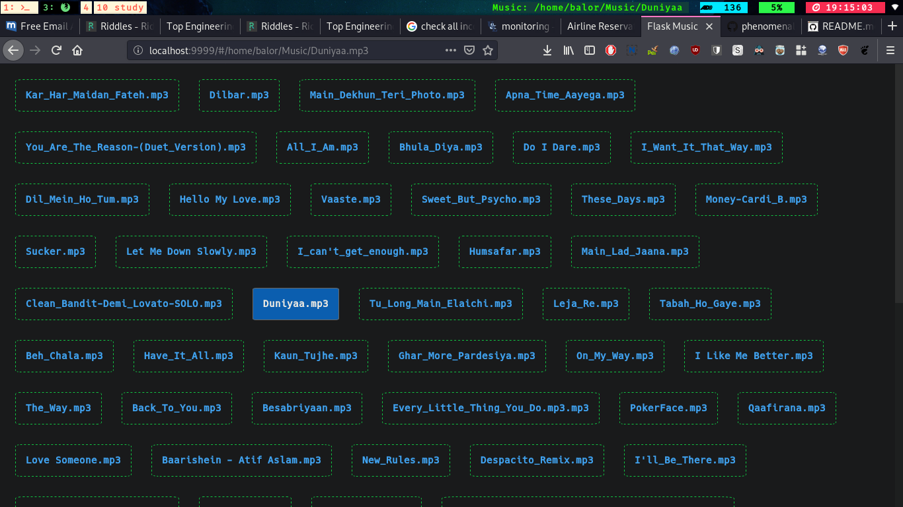

# PyMusic

A Web based Music Player written using Python Flask and basic FrontEnd HTML + CSS

It plays Local Music but also has the potential for Internet Streams

## Getting Started
+ Fire up your Terminal and Clone this repository
+ `cd` into the repo
+ Install the required python modules `pip install -r requirements.txt`
+ Execute the **main.py** like `python main.py`  
+ Then, Flask Web Server would fireup at default port **9999**
+ Enter `localhost:9999` in your browser's URL bar and enjoy the music

